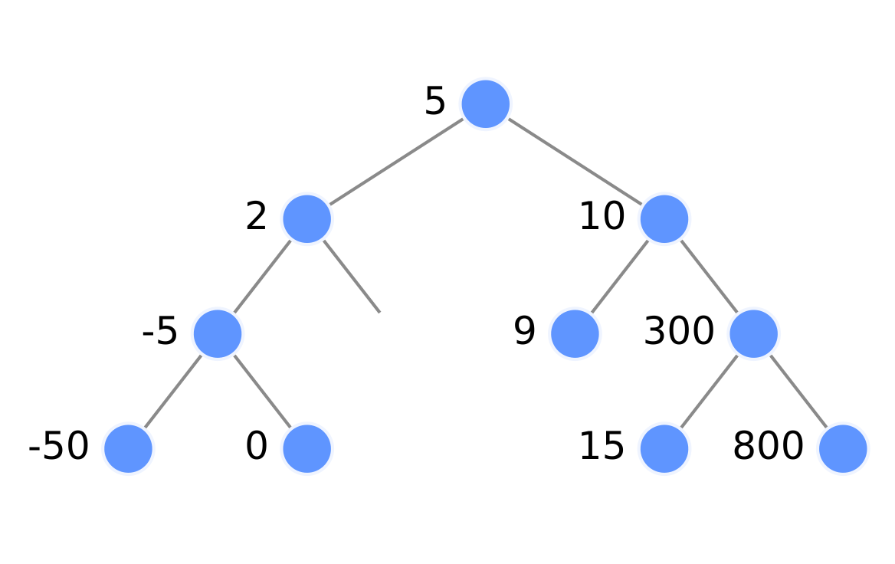
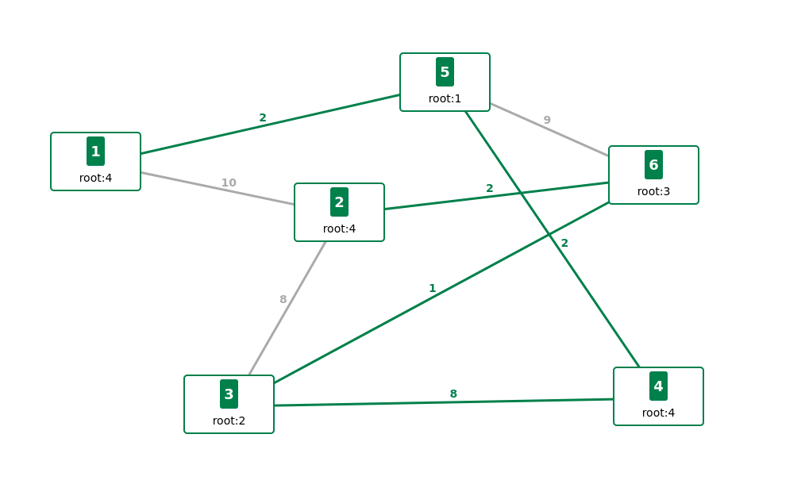
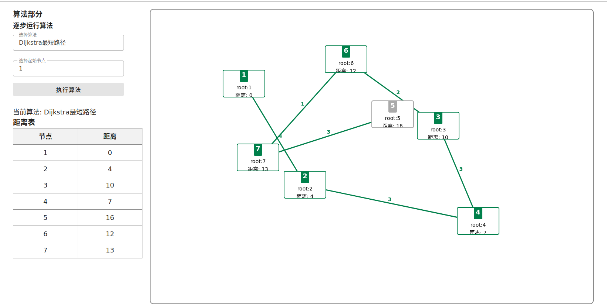

# tree-visualize

## 预览  
[点击查看预览](https://w1412x.github.io/Data-Structure-Algorithm-Visualize/dist/)  

## 扩展  
- 你可以在`algorithm`中添加新的算法并在`pages`中新建页面进行扩展，并将您扩展的算法添加在首页`IndexPage.vue`中  

## collaborator  
[@wh](https://github.com/zzysssigm)
[@W1412X](https://github.com/W1412X)

## Project setup
```
npm install
```

### Compiles and hot-reloads for development
```
npm run serve
```

### Compiles and minifies for production
```
npm run build
```

### Lints and fixes files
```
npm run lint
```

### Customize configuration
See [Configuration Reference](https://cli.vuejs.org/config/).

## 展示
### 排序树  

### kruskal
  
### dijskral  
  


## 扩展说明
### 踩坑记录  
- F6的TreeGraph用不了，报构造函数的错(也许是版本问题)  
- G6的TreeGraph的最新版本(5.x)用不了  
- 使用的G6 4.x的库    

### 算法放在 @/algorithm 中实现  
- 可以看一下已经存在的算法之后进行扩展  
### G6地址   
https://g6-v4.antv.vision/manual/introduction